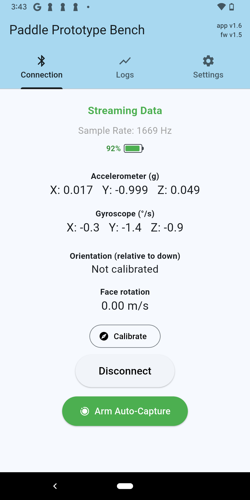
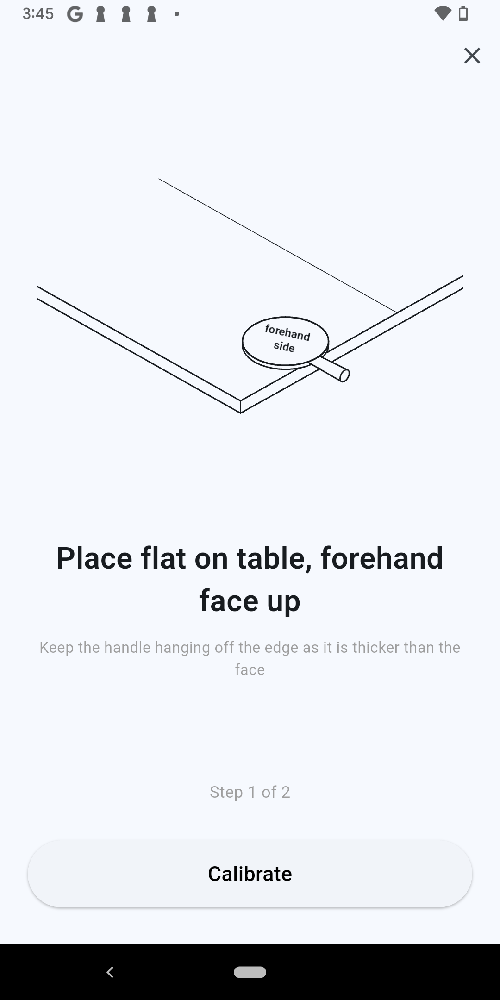
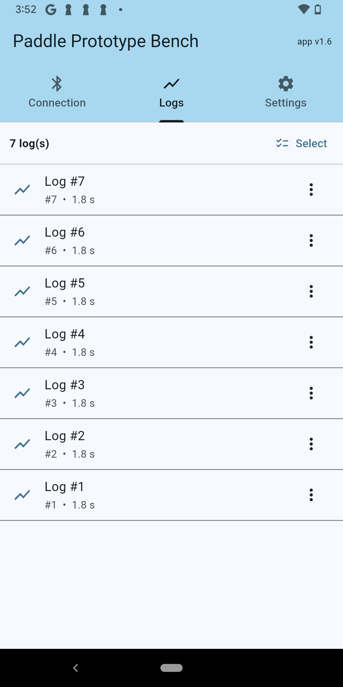
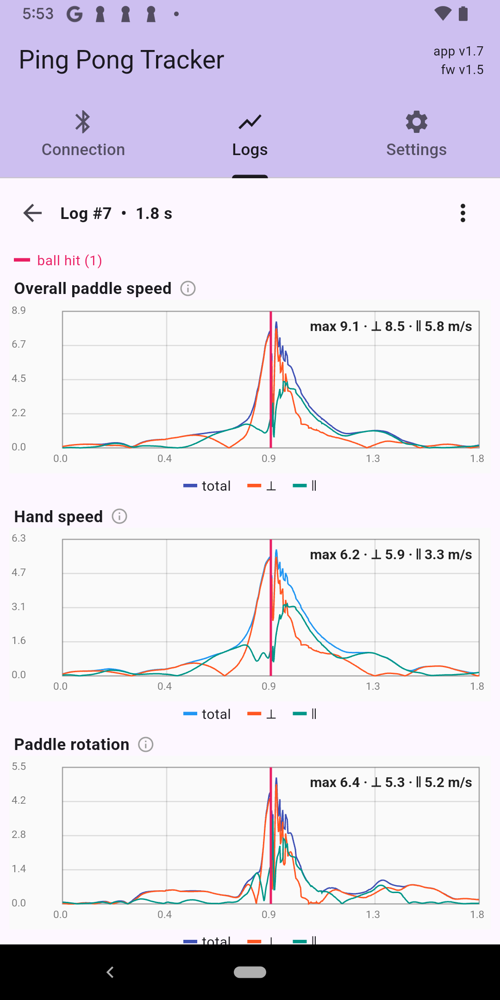
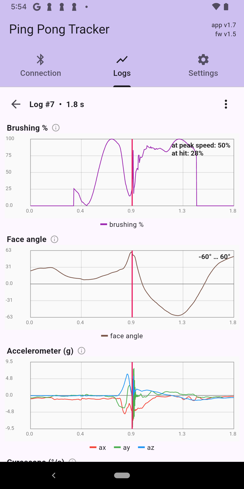
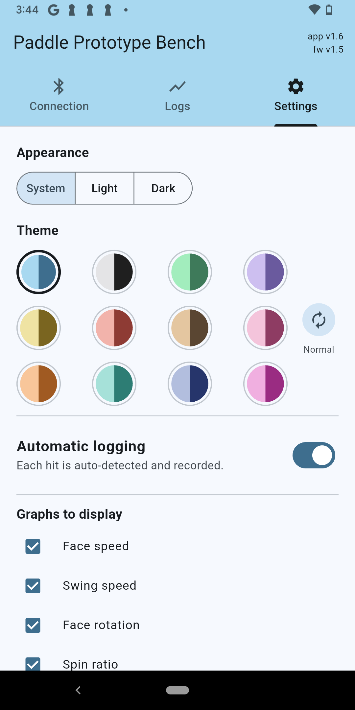
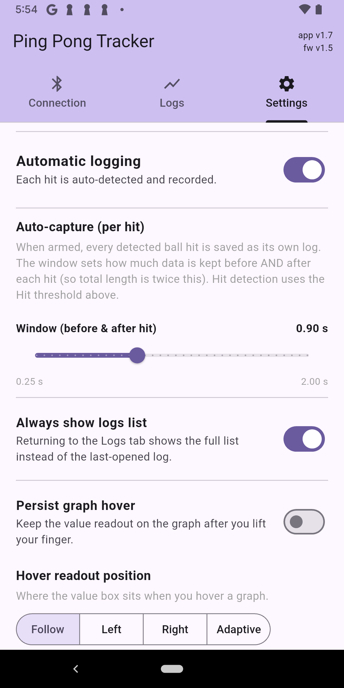
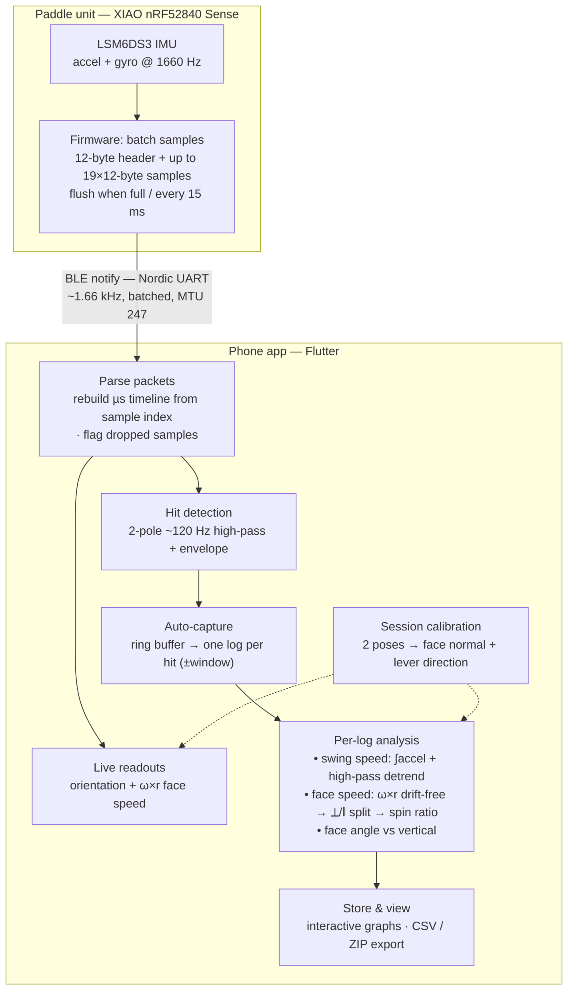
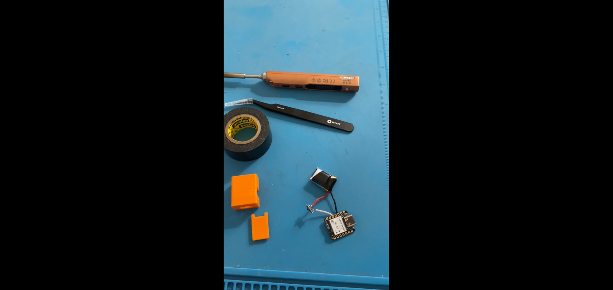

# Ping Pong Tracker

> An advanced ping pong paddle motion tracker, attached to the base of the handle, that sends 6-axis IMU data to a phone app at 1660 Hz via BLE. The phone app saves and displays the data in a readable format, analyzing hit time, paddle speed, spin ratio, and more for every shot, allowing users to easily analyze their shot quality and find shortcomings in their swings.

---

## Demo

<!-- Lead with an autoplaying GIF (plays inline, no click needed). Keep it 5-10s. -->

**Full demo video:** [ YouTube link goes here ]

---

## Overview

There are sports trackers out there for racket sports, but they tend to be expensive, with ping pong being one of the most expensive as it generally relies on technology embedded within the paddle itself. My goal is to create a budget-friendly alternative that can still accurately track metrics like swing speed, hit timing, and spin. My tracker uses a lightweight 3D printed case, housing a XIAO nRF52840 Sense microcontroller (with onboard 6-axis IMU) soldered to a 100 mAh LiPo battery pack. The whole unit weighs ~7g and is mounted to the base of the handle, and has features as described in the next section.

---

## Features

- Accelerometer and gyroscope streaming at 1660 Hz to accurately capture swing motions
- Automatic hit detection to automatically log data before and after each hit
- Manual logging mode to log practice swings
- Metrics for every log including swing speed, spin ratio, paddle orientation, and hit timing
- Rechargeable battery pack via USB-C port
- Straightforward app interface, color themes, light and dark mode, and very flexible settings options

---

## Screenshots

<!-- 2-4 app screenshots. A table keeps them aligned. -->
| Connection screen | Calibration wizard | Logs list | Log graphs | More log graphs | Settings | More settings |
|---|---|---|---|---|---|---|
|  |  |  |  |  |  |  |

---

## How it works

The paddle is a fast, "dumb" streamer — it just samples and ships raw IMU data;
**all interpretation happens on the phone.**

**End to end:**

1. **Sample** — the XIAO's LSM6DS3 reads accelerometer + gyroscope at 1660 Hz.
2. **Batch & stream** — the firmware packs samples into BLE notifications over the
   Nordic UART service: a 12-byte header (sample index, timestamp, battery, count,
   cell mV) plus up to 19 samples (6× int16 each), flushed when the buffer fills or
   every 15 ms, sized to the negotiated MTU and ~7.5–15 ms connection interval.
3. **Parse** — the phone rebuilds an absolute microsecond timeline from the
   per-sample index, so a lost packet shows up as a time gap and is flagged as
   dropped samples; raw counts are scaled to g and °/s.
4. **Detect hits** — a 2-pole ~120 Hz high-pass plus an envelope follower isolates
   the ball's high-frequency impact "ring" from low-frequency swing motion and
   fires once per hit.
5. **Capture** — in auto mode a ring buffer holds the last few seconds, so each hit
   is cut into its own log (a window before and after the impact).
6. **Analyze each log** — replaying its samples yields swing (hand) speed by
   integrating gravity-removed acceleration and high-pass-detrending the drift;
   drift-free **face speed** from ω×r, split via the session calibration into
   perpendicular (closing) and parallel (brushing) parts to give the **spin ratio**;
   and the **face angle** relative to vertical.
7. **Store & export** — logs are saved as binary files and shown as interactive
   graphs, exportable to CSV/ZIP.

A quick two-pose calibration at the start of each session fixes the paddle's face
normal and lever direction; these are **frozen into each log**, so metrics never
shift if you recalibrate later.

---

## Technical highlights

<!-- The hard parts. This is what depth-checking engineers scan for. -->
- The 6-axis IMU streams at its maximum (hardware constrained) frequency of 1.66 kHz via BLE to the phone app, packaged with timestamps. App notifies the user of any dropped data packets.
- Speed is calculated by integrating accelerometer data and combining with gyroscope data. Accelerometer data contains natural drift when integrated, which is fixed by a centered moving average high-pass.
- The app has a calibration feature that is done at the start of each session, which calibrates by measuring gravitational acceleration in two paddle positions and allows for data such as paddle angle.
- The app uses a 2-pole high pass filter to determine when the ball was hit by detecting high-frequency paddle vibrations and records these in each log, enabling the automatic logging feature that records one log per hit. This also enables the ability to analyze swing quality by looking at points of maximum speed and spin generation compared to hit timing.

---

## Hardware

<!-- Photos of the assembled device + mount — physical build is a differentiator. -->

**Parts list**

| Part | Notes | Link |
|---|---|---|
| XIAO nRF52840 Sense | microcontroller with 6-axis IMU | https://www.amazon.com/dp/B0DJ6PZGB7 |
| 100 mAh LiPo Battery Pack | rechargeable battery pack to power the microcontroller | https://www.amazon.com/dp/B083NWXLTK |
| 1P2T Mini Slide Switch | switch to turn the unit on and off | https://www.amazon.com/dp/B01N25FBWD |

**3D-printed mount (optional):** STL files for the case and lid are in [`stls/`](stls/) (`case.stl`, `lid.stl`). The printed mount is optional — it houses the board and battery and attaches to the base of the handle, but you can also secure the electronics directly to the paddle with tape or velcro.

---

## Assembly
Watch the video below for assembly instructions, then move on to **Getting Started**.

  

---

## Getting started

1. **Flash the firmware** — download the latest **`.uf2`** from the [Releases page](https://github.com/RuiqiLiu2014/ping-pong-tracker/releases). Plug the board into your computer with a USB-C data cable and double-tap the reset button to enter bootloader mode (a `XIAO-SENSE` drive appears). Drag the `.uf2` onto that drive; it flashes and reboots automatically.
2. **Install the app** — choose your platform:
   1. **Android** — download the latest **`.apk`** from the [Releases page](https://github.com/RuiqiLiu2014/ping-pong-tracker/releases) and open it to install (allow "install from unknown sources" if prompted).
   2. **iOS** — build from source on a Mac with Xcode: clone this repo, then run `cd app && flutter build ipa`, or open `ios/Runner.xcworkspace`, select your signing team, and run it to your iPhone (requires Xcode + your Apple ID for signing).
3. **Power on** — mount the board at the base of the paddle handle and flip the switch on; the LED blinks blue while it looks for the app.
4. **Connect & calibrate** — open the app, tap **Connect to Paddle**, then **Calibrate** and follow the two-pose wizard.
5. **Play** — start swinging. Each hit is auto-detected and logged; open a log to see speed, spin, and orientation. Adjust settings and themes as desired. Read the user guide below for details.

---

## User guide

**Power & charging**
- Flip the switch on the case to turn the board on.
- **The board only charges while the switch is ON.** Flip it on, then plug in USB-C — the LED turns green (blinking while charging, solid when full). Charging pauses data streaming.

**LED reference**

| LED | Meaning |
|---|---|
| Blinking blue | Searching for the app |
| Solid blue | Connected to the app |
| Blinking green | Charging |
| Solid green | Done charging |
| Alternating green/red | Plugged in but not charging (flip the switch to charge) |
| Blinking red | Battery low, searching for the app |
| Solid red | Battery low, connected to the app |

**Using the app**
- **Calibrate** at the start of each session (two quick poses) for accurate speed and angle.
- **Auto-capture** (default): every detected hit becomes its own log. Switch to manual logging mode if needed.
- **Manual logging**: for practice swings with no ball — start/stop recording yourself (toggle in Settings).
- Open a log to see swing speed, spin ratio, face angle, and hit timing; export as CSV from the log menu.

---

## Repository structure

- app: contains the flutter app
- calibration_drawings: contains SVG files for calibration wizard images
- firmware: contains firmware deployed to the board for data collection
- stls: contains STL files for 3D printed case

---

## Future Steps

- Implement a TinyML model to classify swings, allowing for grouping logs in the app based on swing type and better analysis among swings. Allows for focused improvement of certain swings.
- Improved metrics and in-app analysis of multiple logs.
- Use dual-endpoint ZUPT and direction-reversal zeroing for more accurate speed integration.
- Add a phone camera with YOLO to track the paddle frame by frame, allowing for more accurate metrics and live swing analysis.
- Add a live AI coach feature to the app.

---

## License

This project is licensed under the MIT License — see [LICENSE](LICENSE) for details.
